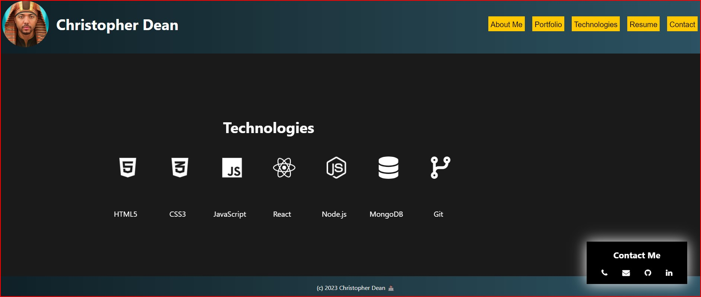

# 20-React-Portfolio Challenge Assignment

## Description

This project is a personal portfolio website built using React.  The website contains several sections, including an About Me section, a Portfolio section, a Technologies section, a Resume section, and a Contact section.  The user can navigate to each section using the navigation bar at the top of the page.

## Table of Contents

* [Usage](#usage)
* [Deployed Application](#deployed-application)
* [Technologies](#technologies)
* [GitHub Repository](#github-repository)
* [Questions](#questions)
* [License](#license)
* [Screenshots](#screenshots)

## Usage

The user can navigate to each section using the navigation bar at the top of the page.  The user can also click on the links in the Portfolio section to view the deployed applications.

## Deployed Application

https://coderchrisdean.github.io/supreme-waffle/.

## Technologies

This project was built using the following technologies:

* React
* JavaScript
* HTML
* CSS
* Three.js (coming soon)
* Font Awesome
* Tippy.js

## GitHub Repository

https://github.com/coderchrisdean/supreme-waffle

## Questions

If you have any questions about this project, please contact me at coderchrisdean@gmail.com.

## License

MIT License

## Screenshots

